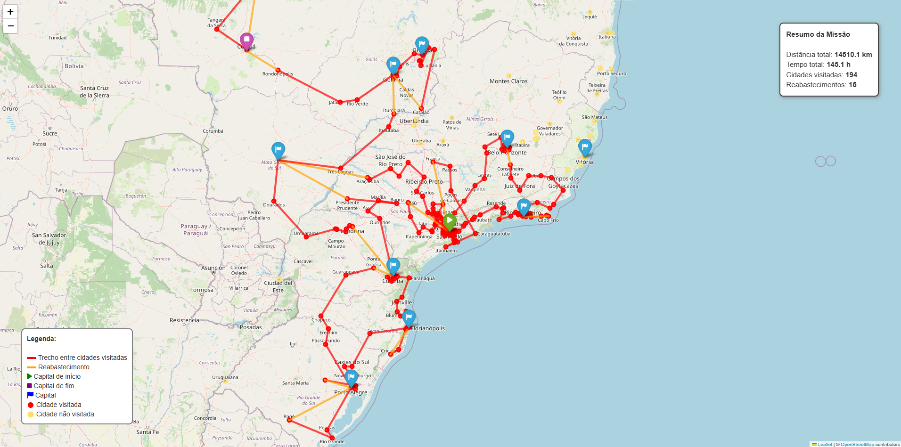

# Intelligent Drone Planning for Flood Monitoring using AI



### Overview
This project implements an intelligent drone route planning system for monitoring flood-affected cities in Brazil. The system uses a greedy algorithm to optimize drone routes, considering factors such as maximum autonomy, city priorities, and efficient refueling stops.


### Features
- **Intelligent Route Planning**: Optimizes drone routes to maximize coverage of flood-affected cities
- **Autonomous Operation**: Considers drone's maximum range (750km) and refueling requirements
- **Smart Capital Selection**: Automatically determines the best starting capital based on coverage efficiency
- **Interactive Visualization**: Displays routes and city information on an interactive map
- **Detailed Statistics**: Provides comprehensive information about the route, including:
  - Total distance traveled
  - Number of cities visited
  - Number of refueling stops
  - Time estimates
  - Coverage statistics

### Requirements
- Python 3.8+
- Required packages (install via `pip install -r requirements.txt`):
  - pandas
  - folium
  - geopy
  - numpy

### Installation
1. Clone the repository:
```bash
git clone https://github.com/yourusername/Intelligent-Drone-Planning-for-Flood-Monitoring-using-AI.git
cd Intelligent-Drone-Planning-for-Flood-Monitoring-using-AI
```

2. Install dependencies:
```bash
pip install -r requirements.txt
```

### Usage
1. Place your flood data CSV file in the project directory
2. Run the main script:
```bash
python main.py
```

The script will:
1. Load and process the flood data
2. Calculate the optimal starting capital
3. Generate the drone route
4. Create an interactive map visualization
5. Save the results as `drone_route.html`

### Output
The program generates an interactive HTML map showing:
- Drone route with color-coded segments
- Visited cities with detailed information
- Non-visited cities
- Refueling stops
- Route statistics and summary

### Project Structure
```
├── main.py              # Main execution script
├── route_planner.py     # Route planning algorithm
├── map_visualizer.py    # Map visualization module
├── data_processor.py    # Data processing utilities
├── requirements.txt     # Project dependencies
└── README.md           # This file
```